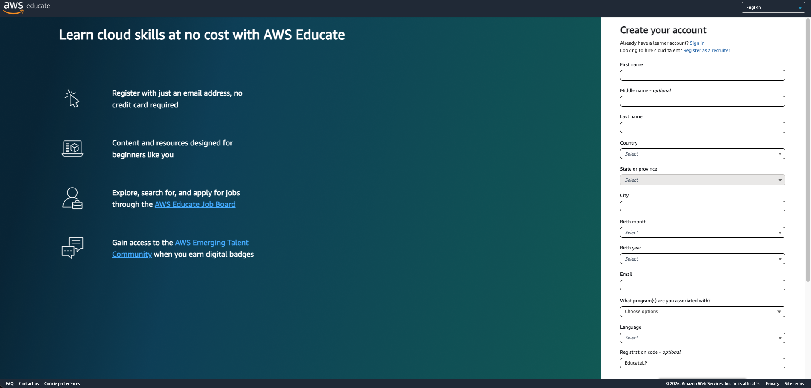
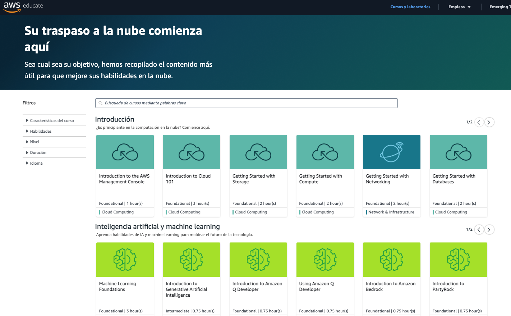

# Crear una cuenta en AWS Educate ☁️

En esta guía se explican los pasos para crear una cuenta en **AWS Educate**, la plataforma de aprendizaje de **Amazon Web Services (AWS)** diseñada para estudiantes y educadores que desean adquirir habilidades en computación en la nube.

---

## 1. Acceder a AWS Educate

Abre tu navegador y dirígete a la página oficial de AWS Educate:

🔗 https://aws.amazon.com/es/education/awseducate/

Luego haz clic en **"Regístrese ahora"** en la esquina superior derecha.

---

## 2. Completar tu perfil

Una vez iniciado el registro, deberás completar la información solicitada, como:

- Institución educativa  
- Nivel de educación  
- Área de estudio  

Después de completar los campos requeridos, haz clic en **"Create account"**.

Cuando aparezca la pregunta **"What program(s) are you associated with?"**, selecciona:

**AWS Skill Builder**

Finalmente, haz clic en **"Continuar"**.

---

## 3. ¡Cuenta creada!

Si el proceso se completó correctamente, tu cuenta en **AWS Educate** habrá sido creada exitosamente.

Ahora podrás acceder a:

- Cursos de computación en la nube  
- Laboratorios prácticos  
- Rutas de aprendizaje  
- Recursos educativos de AWS  

---

## 🎓 Recomendación

AWS Educate ofrece **créditos gratuitos para estudiantes**, los cuales puedes utilizar para practicar con servicios de AWS sin costo adicional.

Aprovecha estos recursos para aprender, experimentar y desarrollar tus habilidades en la nube.

🚀 ¡Disfruta tu viaje aprendiendo AWS!