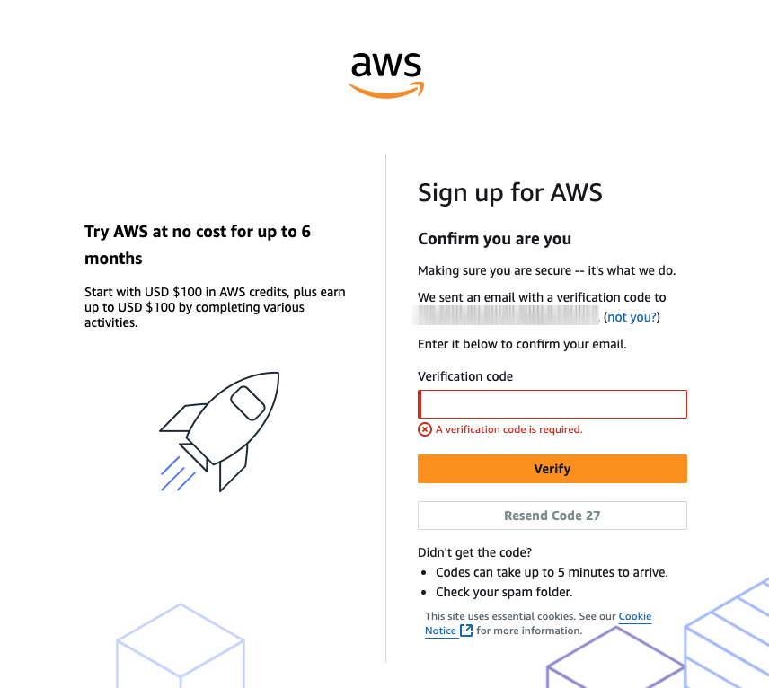
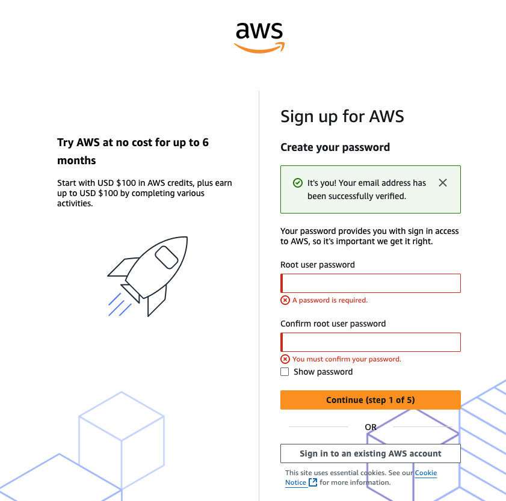
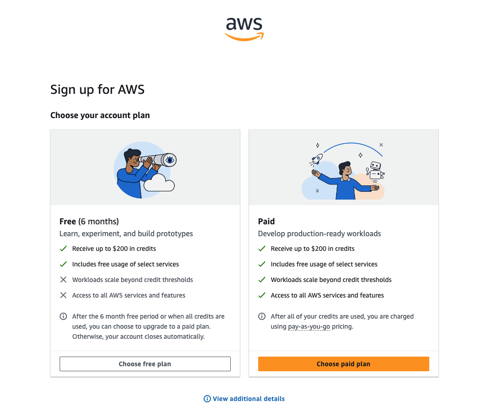
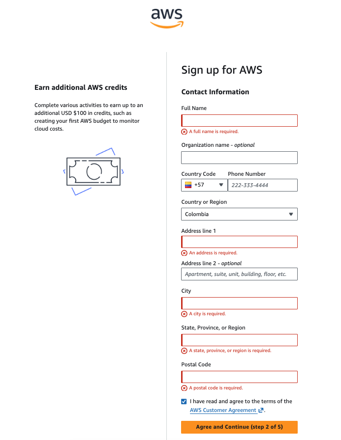
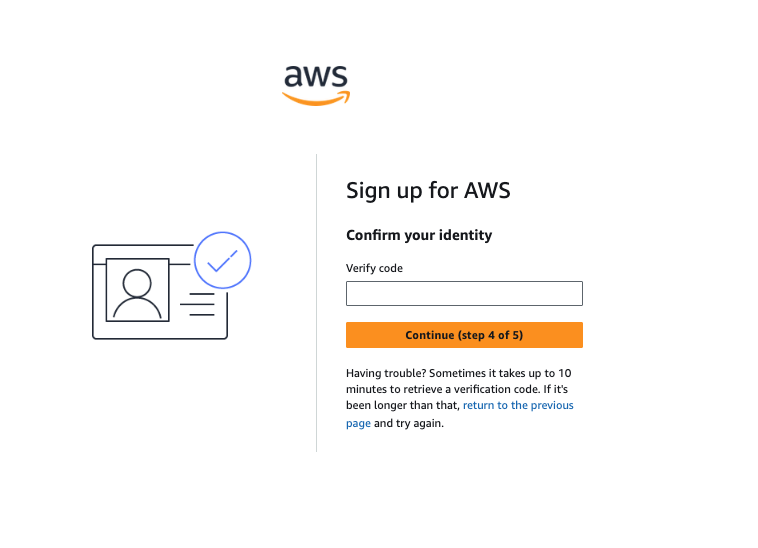
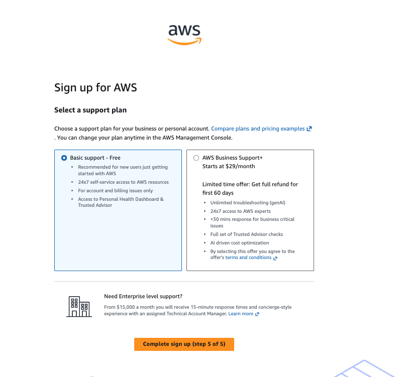

# Crear una cuenta en AWS

El **Free Tier** de Amazon Web Services (AWS) permite a los nuevos
usuarios acceder de forma gratuita a varios servicios de la nube durante
un tiempo limitado y con ciertos límites de uso. Esto permite aprender,
experimentar y desarrollar proyectos sin incurrir en costos.

> ⚠️ Aunque el Free Tier es gratuito, AWS solicita una tarjeta de
> crédito o débito para verificar la identidad del usuario.

------------------------------------------------------------------------

## Pasos para crear una cuenta en AWS

### 1. Ir a la página de AWS Free Tier

Ingresa al siguiente enlace:

https://aws.amazon.com/es/free/

Haz clic en **"Crear una cuenta de AWS"**.

------------------------------------------------------------------------

### 2. Iniciar sesión o registrarse

Serás redirigido a la página de acceso.

-   Si ya tienes una cuenta de Amazon, puedes usarla para iniciar
    sesión.
-   Si no tienes una cuenta, haz clic en **"New to AWS? Sign up"** para
    registrarte.

------------------------------------------------------------------------

### 3. Crear tu cuenta

Completa el formulario con:

-   Correo electrónico
-   Nombre de la cuenta de AWS
-   Contraseña

Luego haz clic en **"Verify email address"**.

------------------------------------------------------------------------

### 4. Verificar el correo electrónico

AWS enviará un **código de verificación** a tu correo.

1.  Copia el código.
2.  Pégalo en el campo correspondiente.
3.  Haz clic en **"Verify"**.

------------------------------------------------------------------------

### 5. Confirmar contraseña

Introduce nuevamente tu contraseña y haz clic en **"Continue"**.

------------------------------------------------------------------------

### 6. Seleccionar el tipo de cuenta

Selecciona el tipo de cuenta que deseas crear:

-   **Personal** (recomendado para estudiantes)
-   **Business**

Luego haz clic en **"Continue"**.

------------------------------------------------------------------------

### 7. Completar la información de contacto

Ingresa la siguiente información:

-   Nombre completo
-   Número de teléfono
-   Dirección

Después haz clic en **"Continue"**.

------------------------------------------------------------------------

### 8. Registrar un método de pago

AWS te pedirá una tarjeta de **crédito o débito**.

Esta tarjeta se utiliza para:

-   Verificar tu identidad
-   Cobrar solo si superas los límites del Free Tier

Haz clic en **"Continue"**.

------------------------------------------------------------------------

### 9. Verificación de identidad

AWS realizará una verificación que puede incluir:

-   Un cargo temporal de **1 USD** (que luego será reembolsado).
-   Una verificación por **SMS o llamada telefónica**.

Ingresa el código recibido y haz clic en **"Continue"**.

------------------------------------------------------------------------

### 10. Seleccionar un plan de soporte

AWS ofrece varios planes de soporte.

Selecciona:

**Basic Support (Gratis)**

Luego haz clic en **"Complete Sign Up"**.

------------------------------------------------------------------------

### 11. Confirmación de la cuenta

Recibirás un correo de confirmación.

1.  Abre el correo.
2.  Haz clic en el enlace para verificar tu cuenta.

------------------------------------------------------------------------

### 12. Acceder a la consola de AWS

Una vez verificada la cuenta, podrás iniciar sesión en la **Consola de
administración de AWS**.

https://console.aws.amazon.com/

------------------------------------------------------------------------

## ¡Listo!

Ahora ya tienes una cuenta en **Amazon Web Services (AWS)** y puedes
comenzar a explorar los servicios de la nube.

💡 Recuerda revisar los límites del **Free Tier** para evitar cargos
inesperados.
