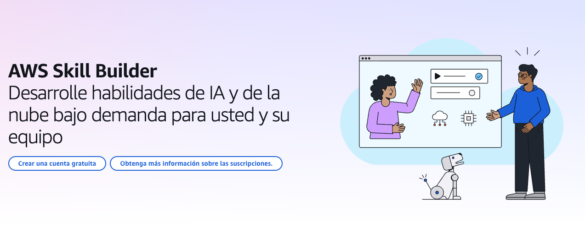
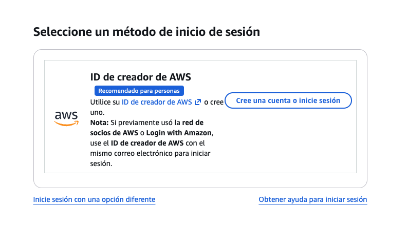
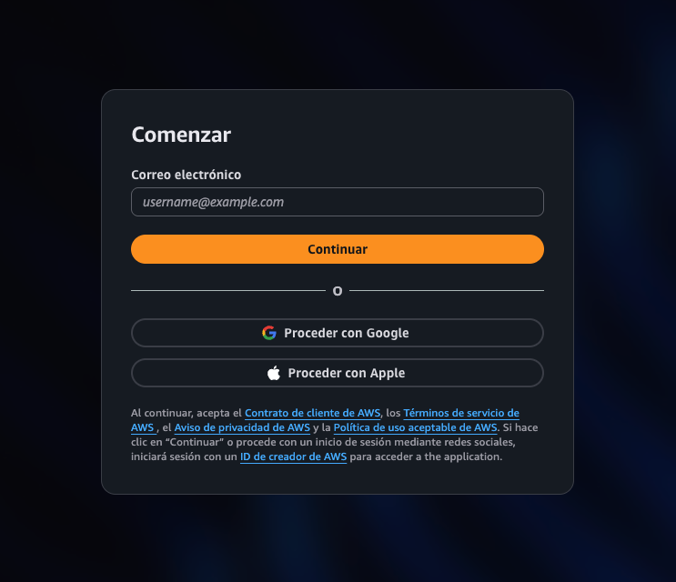
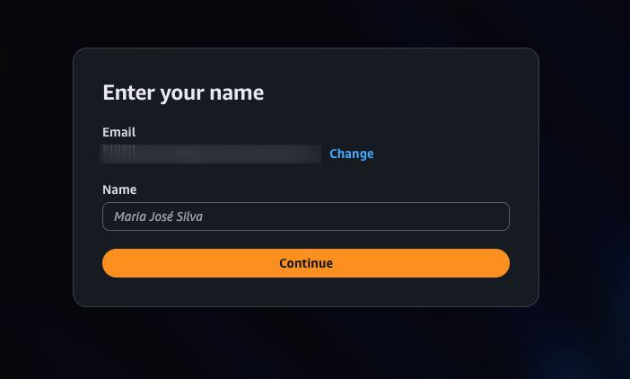
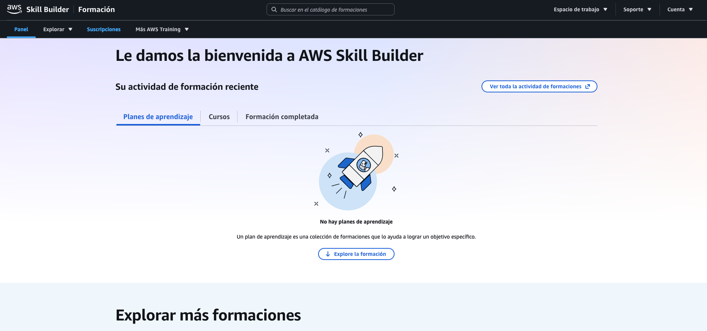

# Crear una cuenta en AWS Skill Builder ☁️

En esta guía se explican los pasos para crear una cuenta en **AWS Skill Builder**, la plataforma oficial de aprendizaje de **Amazon Web Services (AWS)** donde podrás acceder a cursos, laboratorios y rutas de certificación sobre computación en la nube.

---

## 1. Acceder a AWS Skill Builder

Abre tu navegador y dirígete a la página oficial:

🔗 https://skillbuilder.aws/

Luego haz clic en **"Crea una cuenta gratuita"** en la esquina superior derecha.

---

## 2. Iniciar sesión o registrarse

Serás redirigido a la página de acceso.

Haz clic en **"Cree una cuenta o inicie sesión"** para comenzar el proceso de registro.

---

## 3. Ingresar tu correo electrónico

Completa el formulario con tu **correo electrónico**.

Luego haz clic en **"Continuar"** y sigue las instrucciones para crear tu cuenta.

---

## 4. Colocar tu nombre

Ingresa tu **nombre** y haz clic en **"Continuar"**.

---

## 5. Verificación de correo electrónico

AWS Skill Builder enviará un **código de verificación** a tu correo electrónico.

1. Revisa tu bandeja de entrada.  
2. Copia el código recibido.  
3. Ingresa el código en la página de verificación.  

Luego haz clic en **"Continuar"**.

---

## 6. Crear una contraseña

Crea una **contraseña segura** para tu cuenta, confírmala y haz clic en **"Continuar"**.

---

## 7. Aceptar términos y condiciones

Lee los **términos y condiciones** y haz clic en **"Aceptar términos"** para continuar.

---

## 8. Configuración de la cuenta

Completa la información solicitada, como tu **país o región**, y haz clic en **"Continuar"**.

También aparecerán algunos campos relacionados con **información profesional**. Estos pueden **omitirse si lo deseas**.

---

## 9. Configuración de AWS Training & Certification

Selecciona tus **preferencias de aprendizaje** y haz clic en **"Perfil completo"** para finalizar la configuración.

---

## 10. ¡Cuenta creada!

¡Tu cuenta en **AWS Skill Builder** ha sido creada exitosamente!

Ahora podrás acceder a:

- Cursos sobre AWS  
- Rutas de aprendizaje  
- Preparación para certificaciones  
- Laboratorios prácticos  

---

## 🚀 Recomendación

Explora las **Learning Plans** de AWS Skill Builder para seguir rutas estructuradas según tu nivel:

- **Cloud Practitioner** (principiante)
- **Solutions Architect**
- **Developer**
- **DevOps**

Esto te ayudará a avanzar de forma organizada en tu aprendizaje de AWS.